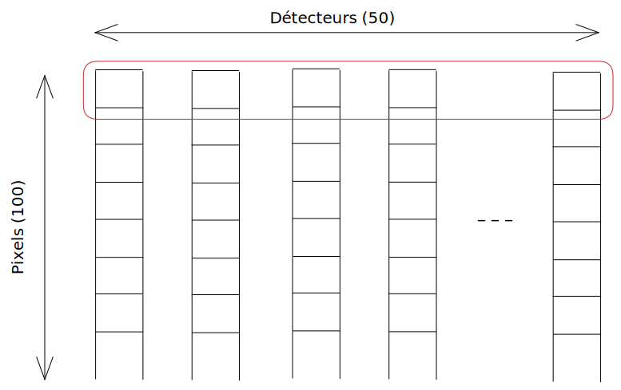
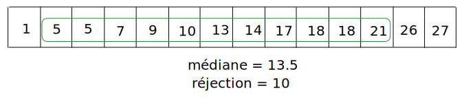
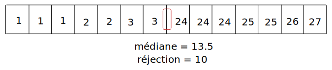
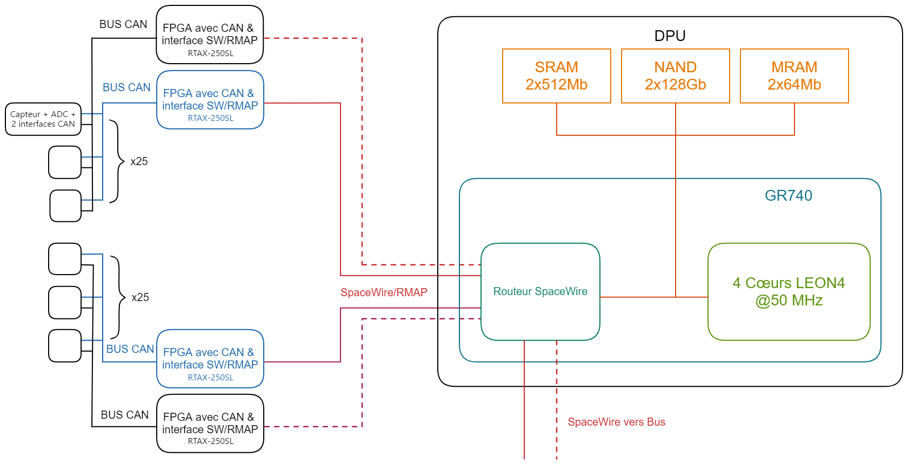

# Compte-rendu du projet Systèmes Embarqués

*Hadrien Caumont, Clément Devatine*

## Logiciel embarqué de traitement

### Fonctionnement

Chaque groupe de données issues des 50 capteurs est traité simultanément.

Le traitement (effectué dans la fonction `batch`) consiste à considérer les mêmes pixels/lignes de tous les capteurs, et de faire tous les calculs sur une seule ligne, avant de continuer sur la suivante. Les données sont donc copiées dans un buffer (en rouge) stockant un pixel de chaque capteur.

> Une approche a été testée où toutes les données sont traitées d'un seul coup, pour exploiter la vectorisation des opérations. Cependant, les performances étaiet moins bonnes que la solution actuelle. Cela est dû au fait que toute la matrice des données doit être transposée avant d'effectuer les opérations, nécessitant un plus grand espace mémoire et défavorisant les *cache-hit*.

Le buffer est alors trié en place en utilisant le moteur de tri fourni.
La médiane est alors calculée avec la formule
$$
M =
    \begin{cases}
        arr[\tfrac{size}{2}] + arr[\tfrac{size}{2} - 1] & \text{si}\ size\ \text{est pair} \\
        arr[\tfrac{size}{2}] + arr[\tfrac{size}{2} - 1] & \text{si}\ size\ \text{est impair} \\
    \end{cases}
$$

Les données étant triées, calculer la moyenne avec réjection des valeurs aberrations devient facile.
En effet, la réjection consiste à éliminer les valeurs qui sont trop écartées de la médiane. Les éléments qui sont à sommer sont consécutifs dans le tableau, et il suffit donc de déterminer les bornes de ces éléments avant de les sommer, plutôt que de parcourir tout le tableau et vérifier si la condition est remplie sur chaque élément.
Pour déterminer les bornes, nous passont par une dichotomie de chaque côté. Nous avons pu déterminer que cela faisait gagner quelques millisecondes comparé à un parcours complet du tableau, malgré un parcours non linéaire des données en mémoire. Cela s'explique par le fait que le cache peut tenir suffisamment bien les données d'une ligne (50 pixels) pour faire disparaître les latences.

Naturellement, il y a quelques situations qui pourraient retourner des données erronnées, notamment lorsque la réjection exclut toutes les données du tableau, donnant une division par zéro dans le calcul de la moyenne. Cela n'est cependant possible que lorsque le tableau est de taille paire avec une tolérance d'erreur inférieure à l'écart entre la médiane et les valeurs utiliées pour calculer cette médiane.

Nous avons fait le choix d'ignorer cette erreur cependant (trop spcifique), autre qu'en mettant une assertion au cas où lors des tests. Il faudra décider comment traiter cette erreur lors de futurs développements.

La moyenne est ensuite stockée dans un vecteur moyenne, ou dans le vecteur de référence, statique, s'il s'agit de la première itération. La vérification de si le pixel est considéré comme un point chaud est déterminé dans la foulée.

### Algorithme de tri

Trois algorithmes de tri ont été testés: 
- L'algorithme *quicksort* du moteur de tri fourni
- L'algorithme *heapsort* du moteur de tri fourni
- L'algorithme de tri la bibliothèque standard

La mesure des performances et caractéristiques de chacun a conduit au choix de l'algorithme *quicksort* du moteur de tri fourni.

La mesure du temps donnait, sur 50 données, en moyenne, sur les données des samples :
- environ 0.20ms pour le *heapsort*
- environ 0.10ms pour le *quicksort*
- environ 0.09ms pour l'algorithme de tri de la biblio standard (sachant que c'est du *quicksort* principalement sous le capot)

Étant donné que l'algorithme standard ne permet pas d'avoir beaucoup de contrôle sur le code sous-jacent et ne propose qu'un gain anecdotique, celui-ci a été éliminé des candidats.
Les deux algorithmes restants ont une complexité moyenne en $\mathcal{O}(n\log n)$. Cependant, la complexité dans le pire cas est $\mathcal{O}(n^2)$ pour le *quicksort*, alors qu'elle reste en $\mathcal{O}(n\log n)$ pour le *heapsort*.
Cependant, des tests sur les cas usuellement difficiles ainsi que des données aléatoires ont montrés que le *quicksort* restait proche des 0.10ms et le *heapsort* autour des 0.20ms. Cela s'explique par le faible nombre de données à trier et le passage rapide au tri par insertion sur les appels profonds du *quicksort* qui l'empêche de perdre trop de temps. Plus de tests sont cependant nécessaires, car il est difficile de déterminer quels sont les cas problématiques pour le *quicksort* étant donné que son code est peu lisible.

L'algorithme retenu est donc le *quicksort* : il s'agit du plus rapide, tout en restant robuste aux données testées.

### Tests du programme de traitement

Les tests ont été effectués successivement en rajoutant les différents étapes du traitement au fur et à mesure, puis en prenant la différence avec le test précédent.
Pour éviter les optimisations du compilateur (notamment les boucles lors de la copie du buffer ou entre les *samples*, une ligne d'assembleur injectant une dépendance avec le compteur de boucle : `__asm__ volatile("" : "+g" (iteration) : :);`).

Cette méthode de test a aussi permis de contourner les restrictions de TSIM, qui n'autorise que 1000 appels à ces commandes (donc au plus 500 mesures avec le *profiler*) dans la version gratuite.

Quelques analyses statistiques ont aussi été effectuées pour déterminer si certains traitement étaient instables en terme de temps (notamment le tri et le calcul de la médiane).

Il est intéressant de noter que pendant les tests, les résultats obtenus du nombre de hotspot et le nombre de hotspot donné dans les données de test ne coïncident pas dans 2 cas (sur 50, voir le fichire `rapport/resultats.txt`). L'explication trouvée à ce propos est que le nombre de hotspots spécifié dans les données de test génère effectivement le nombre de hotspots souhaité, avant de rajouter du bruit (tel que décrit dans les paramètres du générateur), ce qui a parfois pour effet de noyer certains de ces points chaud, les rendant ainsi indétectables, ou en en générant d'autres.

### Performances et charge CPU

Les mesures de performances effectuées sur TSIM avec les samples fournies et des données aléatoires.

Mesure des performances:
| Algorithme | Cycles | Instructions | Temps | Variance | Commentaire |
|-|-|-|-|-|-|
| Copie des pixels dans le buffer | 67460 | 34747 | 1.35ms | 20 cycles, 0µs |  |
| Tri des données & calcul de la médiane | 466147 | 352357 | 10.67ms | 1467 cycles, 29µs |  |
| Calcul des bornes et de la moyenne | 577372 | 377659 | 11.55ms | 1456 cycles , 30µs |  |
| Calcul des hotspots | 614372 | 391913 | 12.29ms | 1678 cycles, 34µs |

La charge CPU finale est donc d'environ 13% sur un seul cœur.
On peut noter que sur le traitement total des données, le tri représente 9ms sur 13ms, soit environ 70% de l'occupation CPU par le programme.

Consommation mémoire:
| Variable | Taille et type | Mémoire consommée |
|-|-|-|
| Vecteur de référence | uiSensorSize * float | 1600 bits |
| Buffer des pixels | uiSensorSize * unsigned short | 800 bits |
| Vecteur traité | uiSensorSize * float | 1600 bits |
| Total + marge (alignement, stack, ...) | - | 4000 bits * 1.5 |

Nous avons aussi essayé de déterminer la taille de l'exécutable pour donner une borne sur le dimensionnement de la mémoire MRAM.
Malheureusement, même en désactivant les options de débogage, l'exécutable ne change pas de taille et reste autour de 10Mo. Une analyze plus détaillée des sections de l'ELF montre que les symboles de débogage sont conservés dans le code de l'exécutable, ce qui rend l'évaluation exacte difficile. On peut cependant estimer que la taille n'excède pas 1.5Mo, soit 12Mbits.

## Architecture

### Overview/Synoptique

L'architecture retenue est basée sur deux bus CAN redondants, chacun connectés à 25 des 50 capteurs. Le bus CAN a été sélectionné par sa faible consommation électrique et faible encombrement par rapport à une architecture SpaceWire, ainsi qu'une plus grande maturité par rapport à des bus I2C et SPI. La nécessité de deux bus CAN dérive de la bande passante maximale du bus can de 1Mb/s, ayant un débit brut de données de 800Kb/s, avec l'ajout de la trame CAN celà dépassait la bande passante maximale. En utilisant deux bus on se place à un taux d'utilisation de 50% du bus, permettant de tenir en compte le poll de chaque capteur par le controlleur et les délais éventuels. Ces deux bus sont eux même dédoublés pour redondance.
Chaque capteur embarque un ADC 16 bis à sortie série, interfaçant avec deux transmetteur CAN convertissant le signal série selon le protocole CAN et transmettant à la puissance nécessaire vers le FPGA.

Les FPGA retenus pour les interfaces CAN vers SpaceWire sont des RTAX-250SL, qui disposent de suffisamment de capacité pour accueillir un IP Core SpaceWire (28% d'occupation) et l'interface depuis le bus CAN, tout en assurant une faible consommation électrique.
Ces FPGA sont connectés à deux transmetteurs CAN, et sont programmés avec un IP Core SpaceWire et un IP Core CAN, ainsi que de la logique nécessaire pour faire le lien entre les deux modules.

Les FPGA sont ensuite connectés par SpaceWire/RMAP juqu'à la mémoire SRAM du DPU en passant par le routeur.

Pour assurer une redondance des liens SpaceWire, il est nécessaire de disposer de quatre liens RMAP entre le FPGA interfaçant avec les bus CAN et le DPU. Pour cela il est nécessaire de disposer d'un routeur SpaceWire.
Le processeur GR740 intègre directement un routeur, et à une faible consommation nominale comparé aux générations précédentes d'architecture LEON. Ce processeur disposant de 4 cœurs, il serait possible de réaliser des traitements en parallèle, ou d'assure une redondance des processus à chaud en cas de besoin.

Le routeur fournis deux lien SpaceWire redondans vers le bus pour transmettre les données.

### Mémoires et justification

On utilise différents types de mémoire, chacune choisie pour convenir de manière optimale à l'utilisation prévue.

Pour le stockage à court terme des données transférées par SpaceWire/RMAP et contenant la mémoire de travail du processeur Leon, deux modules SDRAM de 512Mb chacun ont été choisis, deux pour disposer d'une redoncance.
Cette quantité de mémoire permets stocker de l'intégralité des données des capteurs pendant plusieurs secondes tout en conservant de la capacité pour le fonctionnement de l'algorithme.
Les deux mémoires sont utilisées simultanément en miroir, avec un multiplexage dans les deux FPGA utilisant le RMAP via le SpaceWire

Stockage de masse : Pour le stockage des données deux NAND FLASH sont prévues, organisées en redondance en miroir contenant chacune l'intégralité des données pour redondance, avec option d'utilisation séquentielle en cas de problèmes de communication avec le sol. Ayant 8,64GB de données générées par jour, on suppose une fréquence de descente des données de une fois par jour, on doit donc stocker au minimum cette quantité de données dans la mémoire. Pour conserver des marges deux modules de 16GB chacun (128 Gb) ont été retenus. On trouve un composant qualifié spatial adapté : 3D-Plus 3DFN128G08US8761
En cas de problème de télémétrie on peut dé-paralléliser les deux mémoires et stocker séquentiellement en cas de dépassement des 16 GB disponibles.
Calcul stockage nécessaire : $Total  = ((16*50*100)+32*2)*10*3600*24 = 69.175 Gb/Jour = 8.647 GB/Jour$
Sont ajouté à chaque echantillon de 50*100 pixels un timestamp de 32 bits ainsi que le nombre de hotspots stocké sur 32 bits également.

Concernant le stockage du code exécuté sur le processeur une mémoire MRAM qualifiée spatial de 64Mb a été choisie, en effet les mémoires de type EEPROM n'étais pas recommandées pour nouveaux designs par fabriquant.
La capacité de 64Mb permet le stockage du code compilé dans son intégralité.
### Budget de puissance
Ce budget de puissance corresponds à une estimation basée sur les données disponibles sur les composants retenus, correspondant à la consommation typique.
- CAN tranceiver : 50x50uA + 52x17mA + 2x60mA @ 3.3V = 3.314 W (50 au repos, 52 en écoute du bus, 2 actifs)
- SDRAM 2x155mA x 3,3V - max rating : 1.203W
- NAND 2x51mA x 3,3V =  - max rating : 0.337W
- MRAM max rating : 2x0,6 W = 1.2W
- GR 740 - Max 1.5W - 2W si 4 cœurs + SpaceWire -> supérieur à GR 712 en performances mais plus efficace (routeur intégré)
- FPGA - 2x au repos 50mW + 2x 0.5W actif = 1.1 W 
- SpaceWire : 3 x 50 mW = 150mW (SpaceWire actifs)

Total = 8.804 W
### Débit descendant vers la plateforme
Plusieurs scénarios sont envisageables fournissant plus ou moins de données en fonction du budget alloué à l'instrument.
Le cas le plus optimiste corresponds à une transmission de l'intégralité des données acquises à une fréquence d'une fois par jour, avec un débit de 69.175 Gb/Jour
Dans le cas d'un budget de télémétrie moindre, il est possible d'envisager différent scénarios :
- La descente des prises de vues respectant certains paramètres en terme de nombre de hotspots, dans la limite du budget maxial alloué.
- La descente journalière des valeurs des hotspots de chaque prise de vue, les scientifiques choisissant pour la prochaine fenêtre les échantillons intéressant qui sont descendus. Ce mode de fonctionnement implique un stockage de plus de 128Gb de données et demande donc d'utiliser les deux modules NAND sans redondance
- La descente des données compressées pour limiter la bande passante, avec un gain possible d'un facteur 3 sans pertes -> 23.058 Gb/jour, ceci est envisageable en raison de la faible utilisation du CPU par l'algorithme actuellement implémenté.